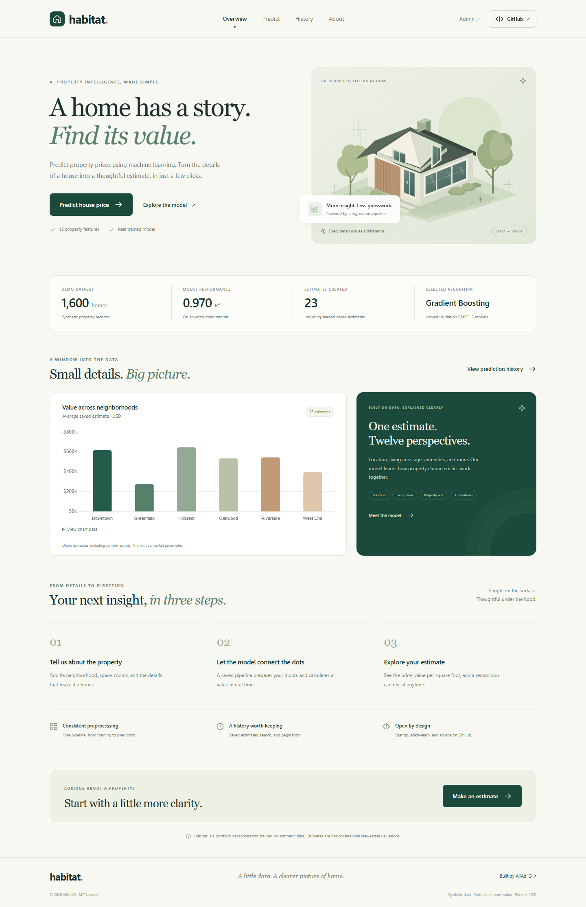
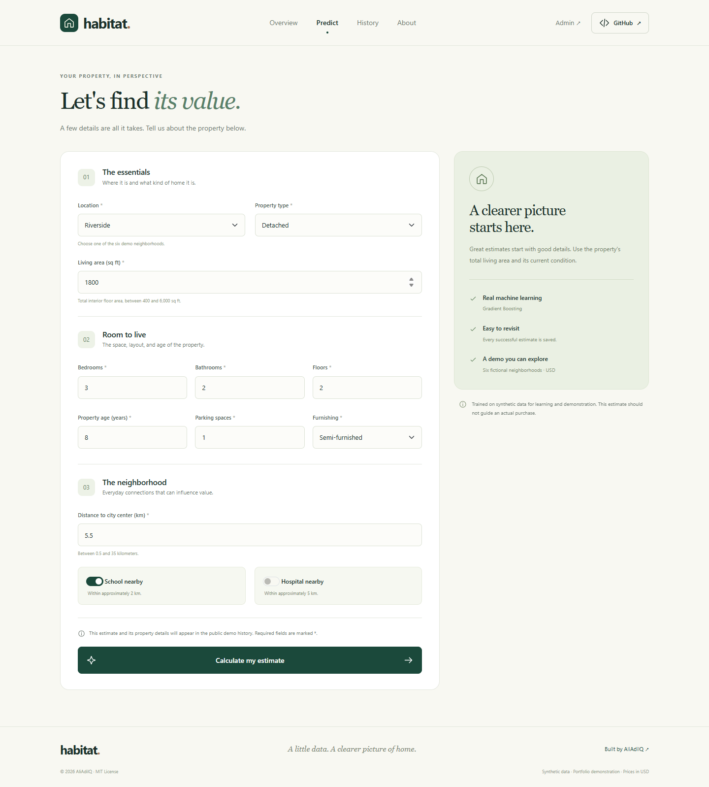
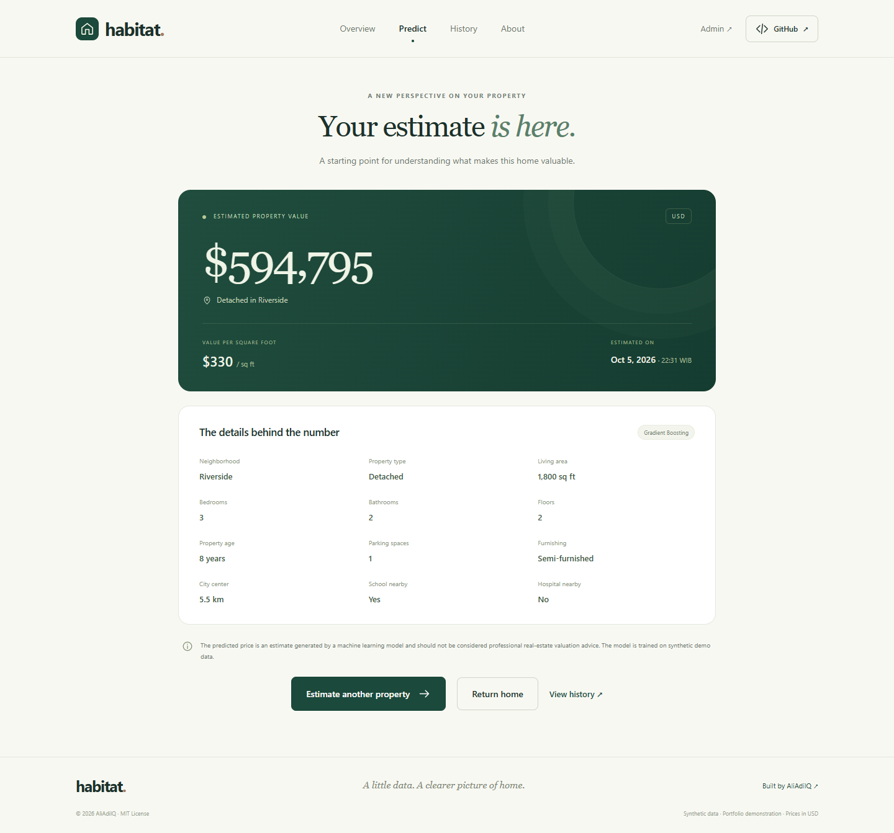
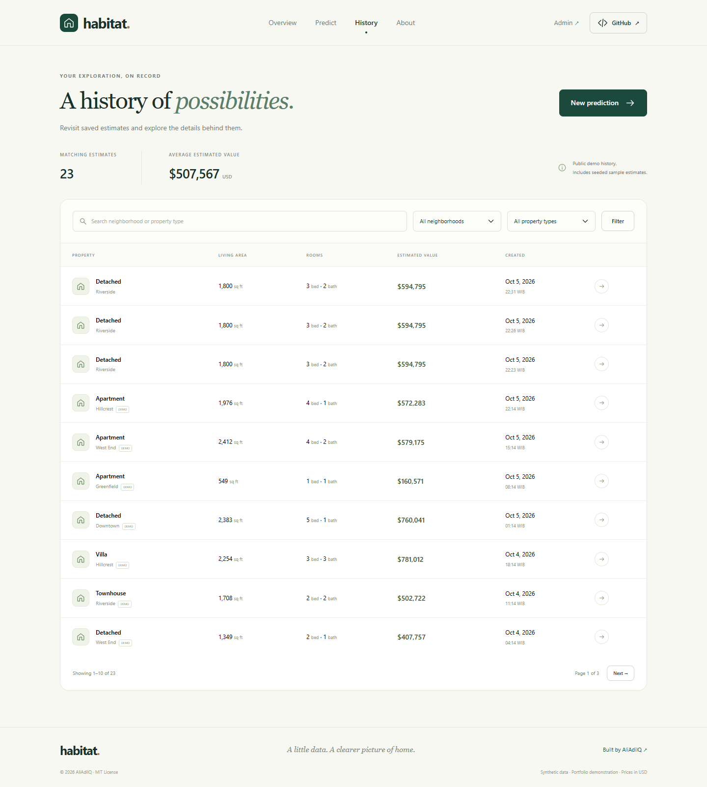
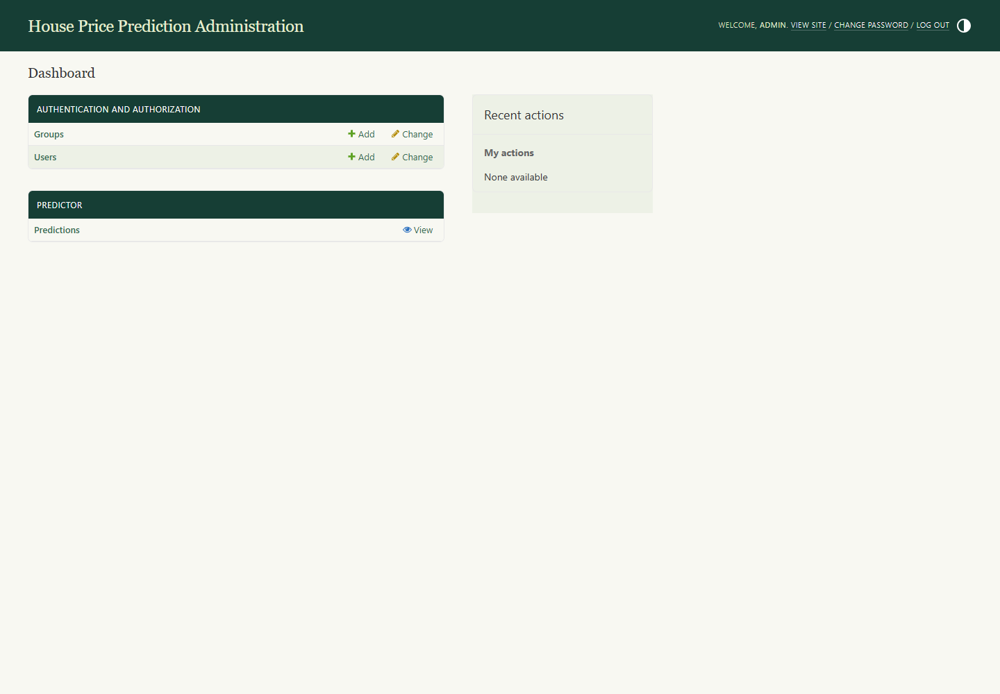

# House Price Prediction

**A thoughtful property estimate, powered by real machine learning.**

House Price Prediction, branded **Habitat**, is a complete Django portfolio application by [AliAdilQ](https://github.com/AliAdilQ). Enter a property's characteristics, receive a USD estimate from a trained regression pipeline, and revisit the result in a searchable history.

[](https://www.python.org/)
[](https://www.djangoproject.com/)
[](https://scikit-learn.org/)
[](LICENSE)



> The included dataset is synthetic and intended for portfolio/demo purposes. Neighborhoods are fictional and prices are in US dollars. This application does not provide professional real-estate valuation advice.

## Overview

Habitat connects data science with a polished web experience: a twelve-feature prediction form, a saved preprocessing pipeline, persistent estimates, a branded admin panel, and actual training metrics. The ivory-and-teal interface includes an original architectural SVG illustration, locally bundled frontend assets, and layouts for desktop, tablet, and mobile.

## Features

- Real ML-based predictions using a serialized scikit-learn regression pipeline.
- Responsive UI with accessible labels, keyboard navigation, and reduced-motion support.
- Django backend, CSRF protection, and server-side plus browser validation.
- Public prediction history with search, neighborhood/type filters, and pagination.
- Django admin dashboard with record inspection, search, date/location/type filters, sorting, and deletion.
- Linear Regression, Random Forest, and Gradient Boosting comparison.
- Automatic numeric imputation/scaling and categorical encoding within `ColumnTransformer` and `Pipeline`.
- A reproducible 1,600-row synthetic dataset and development-only demo seeder.
- Chart.js visualization of average saved estimates by neighborhood, with an accessible data table.
- Friendly errors for unavailable models, prediction failures, database errors, and missing pages.
- A pretrained model, documented management commands, behavior tests, and GitHub Actions CI.

## Demo / Screenshots

Actual browser captures are included in [screenshots/](screenshots/). Start the app locally using the installation instructions below; this repository does not claim a hosted live demo.

## Technology Stack

| Layer | Technologies |
| --- | --- |
| Backend | Python 3.12, Django 5.2, python-dotenv |
| Machine learning | scikit-learn 1.7.2, pandas, NumPy, joblib |
| Frontend | HTML5, CSS3, Bootstrap 5.3.3, JavaScript, Chart.js 4.4.7, original SVG icons |
| Database | SQLite, accessed through Django ORM |
| Verification | Django test runner, optional Playwright screenshot script, GitHub Actions |

Bootstrap and Chart.js are committed under `static/vendor/`, with their MIT licenses. No CDN connection, API key, or frontend build step is needed to run the application.

## Project Structure

```text
house_price_prediction/
├── manage.py
├── requirements.txt
├── README.md / LICENSE / CONTRIBUTING.md / CHANGELOG.md
├── .env.example / .gitignore / .gitattributes
├── .github/workflows/ci.yml
├── house_price_prediction/       # Settings, root routes, WSGI, ASGI
├── predictor/
│   ├── admin.py / forms.py / models.py / urls.py / views.py / tests.py
│   ├── migrations/0001_initial.py
│   ├── management/commands/
│   │   ├── generate_dataset.py
│   │   ├── train_model.py
│   │   └── seed_demo_data.py
│   └── ml/
│       ├── features.py / dataset.py / preprocessing.py
│       ├── model_training.py / service.py
│       └── saved_model/           # Committed pipeline and metadata.json
├── templates/                    # Reusable pages and error templates
├── static/                       # CSS, JS, SVG assets, bundled vendors
├── media/                        # Reserved for future uploads
├── data/house_prices.csv
├── scripts/                      # Vendor refresh and browser capture tools
├── screenshots/                  # Genuine desktop and mobile captures
└── docs/project_documentation.md
```

The virtual environment, local `.env`, SQLite database, and collected static files are intentionally ignored. The compact trained pipeline and demo dataset are committed so a clone can make predictions immediately after database setup.

## Installation

Install **Python 3.12** and Git first. Python 3.8 is not supported. The pinned dependency versions match the bundled model.

```bash
git clone https://github.com/AliAdilQ/house_price_prediction.git
cd house_price_prediction
python -m venv .venv
```

Windows PowerShell:

```powershell
.\.venv\Scripts\Activate.ps1
```

Windows Command Prompt:

```bat
.venv\Scripts\activate.bat
```

Linux/macOS:

```bash
source .venv/bin/activate
```

If PowerShell activation is restricted, use `.\.venv\Scripts\python.exe` in place of `python` for the commands below.

```bash
python -m pip install -r requirements.txt
```

Copy `.env.example` to `.env`:

```powershell
# Windows PowerShell
Copy-Item .env.example .env
```

```bash
# Linux/macOS
cp .env.example .env
```

Generate a local secret with the following command, then replace `your-secret-key` in `.env` with the output. Keep `.env` private.

```bash
python -c "import secrets; print(secrets.token_urlsafe(50))"
```

Initialize the database and demo:

```bash
python manage.py migrate
python manage.py seed_demo_data
python manage.py runserver
```

**Retraining is optional** because `house_price_model.joblib` and `metadata.json` are included. To reproduce the comparison, run this before seeding:

```bash
python manage.py train_model
```

If you intentionally change the ML dependency versions or dataset, retrain the model. Inference refuses a scikit-learn version mismatch. Training is an explicit command; the web server does not train during startup or a user request.

## Application URL

[http://127.0.0.1:8000/](http://127.0.0.1:8000/)

| Page | Local route |
| --- | --- |
| Overview | `/` |
| Prediction form | `/predict/` |
| Individual result | `/result/<uuid>/` |
| Searchable history | `/history/` |
| About and model metrics | `/about/` |

## Admin Panel

[http://127.0.0.1:8000/admin/](http://127.0.0.1:8000/admin/)

Staff can inspect prediction details, search and filter records, sort columns, and delete records. Estimate records are read-only to preserve the relationship between the input features and the model's original output. New estimates are created through the prediction form.

## Demo Admin Credentials

| Field | Value |
| --- | --- |
| Username | `admin` |
| Password | `Admin@12345` |
| Email | `admin@example.com` |

**These credentials are for local demonstration purposes only. Change/remove them before deploying publicly.**

`python manage.py seed_demo_data` creates the demo superuser and 20 sample predictions. It is transactional, disabled when `DEBUG=False`, and idempotent. Rerunning it preserves the existing admin password and uses unique demo keys to avoid duplicate sample records. It refuses to elevate an existing non-superuser named `admin`.

For a separate admin account, use `python manage.py createsuperuser`. For changing the demo password, use `python manage.py changepassword admin`.

## Machine Learning Workflow

```text
Synthetic CSV → Validation/cleaning → 80/20 train/test split
→ Training-only 3-fold cross-validation
→ Fold-local preprocessing + three regression models
→ Best model selection by mean validation RMSE
→ Fit winner on training split → Untouched test-set evaluation
→ Serialize complete pipeline + metadata → Django prediction
```

Numeric features use median imputation and standard scaling. Categorical features use imputation and one-hot encoding. Preprocessing is fitted inside each cross-validation fold, preventing leakage. The holdout set is never used to select the winner, and the saved model remains fitted on the 1,280 training rows so its reported test score describes the committed artifact.

Metadata records metrics, row counts, feature names, training time, dependency versions, and dataset/model SHA-256 hashes. Views read these actual metrics rather than claiming an invented accuracy. Inference verifies the artifact's checksum before loading it; joblib files must still come from a trusted source.

## Model Performance

Actual results for the included dataset, seed `42`, 1,280 training rows, and 320 held-out test rows:

| Algorithm | Validation R² | Validation MAE (USD) | Validation RMSE (USD) |
| --- | ---: | ---: | ---: |
| Linear Regression | 0.9573 | $29,548.74 | $38,413.88 |
| Random Forest | 0.9373 | $36,455.72 | $46,407.80 |
| **Gradient Boosting** | **0.9688** | **$25,152.18** | **$32,805.03** |

Selected model: **Gradient Boosting Regressor**.

| Untouched test-set metric | Result |
| --- | ---: |
| R² | 0.9696 |
| Mean absolute error | $23,344.44 |
| Root mean squared error | $31,482.94 |

R² measures goodness of fit, not an accuracy percentage. MAE is the average absolute price error; RMSE gives more weight to large errors. All values come from actual training and are also available in [metadata.json](predictor/ml/saved_model/metadata.json). Retraining after data changes updates metadata and the UI; update this table when intentionally changing the published artifact.

Strong scores on generated data do not establish performance on a real housing market. Synthetic correlations, limited property types, and the defined input ranges limit the model's use to demonstration.

## Dataset

**The included dataset is synthetic and intended for portfolio/demo purposes.**

[data/house_prices.csv](data/house_prices.csv) contains 1,600 deterministic records. Six fictional neighborhoods have different price-per-area rates. Larger properties generally cost more; location interacts with area, age reduces structural value, and type, furnishing, parking, city proximity, and amenities add value. Multiplicative noise prevents perfectly predictable targets.

| Column | Description / accepted range |
| --- | --- |
| `location` | Downtown, Riverside, Oakwood, West End, Greenfield, Hillcrest |
| `area_sqft` | Total living area, 400–6,000 sq ft |
| `bedrooms` / `bathrooms` | 1–6 bedrooms / 1–5 bathrooms |
| `floors` | 1–3 interior floors; apartments use one |
| `property_age` | 0–60 years |
| `parking_spaces` | 0–4 spaces |
| `property_type` | Apartment, Townhouse, Detached, Villa |
| `furnishing_status` | Unfurnished, Semi-furnished, Fully furnished |
| `distance_city_center` | 0.5–35 km |
| `nearby_school` | 0/1; approximately within 2 km |
| `nearby_hospital` | 0/1; approximately within 5 km |
| `price` | Synthetic target price in USD |

The form also requires at least 120 sq ft per bedroom and bathroom. The form and data cleaner enforce the same category domains and numeric bounds.

To regenerate the original dataset and retrain:

```bash
python manage.py generate_dataset --rows 1600 --overwrite
python manage.py train_model
```

`--overwrite` is required to replace an existing dataset. Changing the dataset does not retroactively change previously saved estimates.

## Screenshots

These images are genuine captures of the running application, not mockups.






Additional captures: [About page](screenshots/about-page.png), [mobile home](screenshots/mobile-home.png), and [mobile prediction form](screenshots/mobile-prediction.png). The overview appears at the top of this README. See [screenshots/README.md](screenshots/README.md) for capture instructions.

## Running Tests

```bash
python manage.py test
python manage.py check
python manage.py makemigrations --check --dry-run
python manage.py collectstatic --noinput
```

Tests cover page rendering, actual pipeline inference, successful prediction persistence, invalid inputs, impossible layouts, CSRF enforcement, missing/corrupt models, incompatible versions, database errors, custom 404 handling, pagination/filters, admin access, demo-seed idempotency, and deterministic data generation. CI installs dependencies, runs migrations, retrains, seeds twice, runs tests, and verifies static collection.

Optional browser verification and screenshot regeneration are described in [screenshots/README.md](screenshots/README.md).

## Future Improvements

- Train and independently validate on a licensed real-world property dataset.
- Add map integration and geographic features.
- Add authentication and private, per-user prediction histories.
- Expose a REST API with appropriate rate limits.
- Migrate to PostgreSQL for production workloads.
- Deploy with production static hosting, logging, and monitoring.
- Compare additional algorithms and calibrate uncertainty intervals on real data.

## Security Note

The demo password is public. Seeding is an explicit local command and never runs automatically. Keep `.env` and `db.sqlite3` out of Git; `.gitignore` handles both. A temporary random secret is available only in development; configure a stable secret in `.env`. Production (`DEBUG=False`) refuses a missing/example secret and enables secure cookies, HTTPS redirects, and HSTS.

**Prediction history is public in this demo.** Only synthetic examples should be entered. The form discloses that inputs and estimates are stored publicly. Before using real property information, add authentication, per-user permissions, privacy controls, and appropriate retention rules.

Before deployment, change/delete the demo account, set `DEBUG=False`, configure `SECRET_KEY`, `ALLOWED_HOSTS`, and `CSRF_TRUSTED_ORIGINS`, and run `python manage.py check --deploy`. Serve with a production WSGI/ASGI server behind HTTPS, configure static files using `collectstatic`, and review proxy settings for your hosting environment. Django's development server is for local use. Never deserialize an untrusted joblib artifact.

SQLite is sufficient for this demonstration. All persistence goes through Django ORM; PostgreSQL migration requires a database driver, environment-based connection settings, migrations, and a deliberate data transfer. No PostgreSQL driver is included in the current requirements because it is not used.

## Contributing

See [CONTRIBUTING.md](CONTRIBUTING.md) for the fork, branch, test, and pull request workflow. Architecture and implementation details are in [docs/project_documentation.md](docs/project_documentation.md).

## License

[MIT License](LICENSE), © 2026 AliAdilQ. Vendored dependencies retain their own MIT notices under `static/vendor/`.

## Author

**AliAdilQ**

GitHub: [github.com/AliAdilQ](https://github.com/AliAdilQ)

Repository: [github.com/AliAdilQ/house_price_prediction](https://github.com/AliAdilQ/house_price_prediction)

To publish the prepared local project, initialize Git if needed, create your first commit, then add the remote only if none exists. Review `git status` before committing. No credentials, database, or virtual environment should be staged.

```bash
git init -b main
git add .
git commit -m "Initial release: Django house price prediction system"
git remote add origin https://github.com/AliAdilQ/house_price_prediction.git
git push -u origin main
```

These publishing commands are instructions for the repository owner. Project setup does not automatically push to GitHub.
