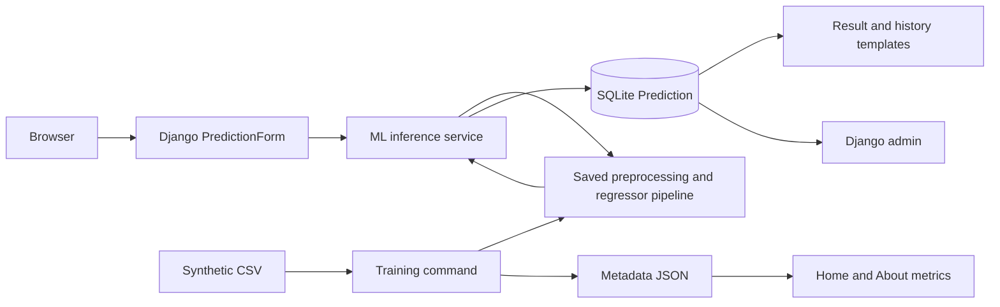

# Project documentation

## Application architecture

Habitat is a server-rendered Django application. `house_price_prediction` contains configuration and project routes. The `predictor` app owns form validation, the `Prediction` database model, public views, management commands, and Django admin registration. ML code lives in `predictor/ml`, separately from HTTP handlers.

## Django request flow

Project routes mount `/admin/` and `predictor.urls`. The public app provides overview, prediction, individual result, history, and about routes. Views pass Python objects to reusable Django templates. `base.html` owns navigation, inline SVG symbols, the footer, and shared local assets. `includes/field.html` renders labels, inputs, hints, and validation messages consistently.

On `GET /predict/`, an unbound `PredictionForm` is rendered. On POST, CSRF middleware verifies the token. A model form validates required values, categories, numeric ranges, integer counts, the minimum area/room relationship, and the single-floor apartment rule. Invalid submissions return the same page with inline field errors and preserved inputs.

Valid submissions call `estimate_price(form.cleaned_data)`. The service verifies metadata and the scikit-learn version, checks the model artifact's SHA-256 checksum, and loads a cached trusted joblib pipeline. A DataFrame contains the exact feature columns used in training. A finite, positive prediction is rounded to cents using `Decimal`, then saved with the model name. Django redirects to `/result/<uuid>/`, following POST/redirect/GET so refreshing the result does not repeat the submission.

The service handles ML failures with a user-safe `PredictionUnavailable` exception. Views log technical details server-side and show friendly errors. Database failures return a 503 page or form message. Custom 404 and 500 templates render when production error handlers apply; Django's normal development debug page remains available while `DEBUG=True`.

## Shared feature schema

`features.py` defines the twelve feature names, category domains, and numeric ranges. The generator, model fields, form controls, cleaner, and inference DataFrame share this schema. Labels and input bounds are user-friendly, while internal CSV/database field names stay consistent.

Features are three categorical inputs and nine numeric/boolean inputs. The cleaner trims categorical strings, removes invalid categories, converts numeric values, removes non-finite/out-of-range values, rejects fractional counts, enforces layout constraints, and removes duplicates. At least 500 valid unique rows are required. The target must be a finite positive USD value. Metadata records discarded rows.

## Synthetic data generation

`dataset.py` uses NumPy's random generator with seed 42. Area is correlated with bedrooms. Six neighborhood rates interact with area and age; depreciation is proportional to structural value. Type, furnishing, amenities, rooms, floors, and parking add premiums, while a decaying distance term captures city proximity. Multiplicative Gaussian noise adds variation. Apartment floor counts and minimum room area constraints are respected.

The resulting 1,600 records are synthetic and are not evidence of a real market. All locations are fictional. Regenerating with identical row count and seed produces the same CSV.

## Training and evaluation

1. Load and validate the CSV, keeping only the feature columns and `price`.
2. Use a reproducible 80/20 train/test split with seed 42.
3. Build an estimator-owned preprocessing pipeline. Numeric columns pass through median imputation and `StandardScaler`; categoricals use most-frequent imputation and dense `OneHotEncoder` output.
4. Compare Linear Regression, Random Forest (180 trees), and Gradient Boosting (300 estimators, learning rate 0.06, Huber loss).
5. Run shuffled three-fold cross-validation on the training partition. Because each estimator is wrapped in a pipeline, preprocessing is fit within the fold, never on validation/test rows.
6. Select the lowest mean validation RMSE. Report mean validation R², MAE, and RMSE for all candidates.
7. Fit the winner on the training partition and evaluate on the untouched 320-row test set.
8. Save the complete pipeline with joblib compression and record metadata. Temporary files are replaced after successful serialization. Do not train while serving traffic; deployment of a new artifact should be coordinated with server restart.

The saved artifact stays fitted on the training partition rather than all rows. This keeps the artifact consistent with its test score. A production model would need real data, stronger validation, monitoring, and a deliberate retraining/deployment process.

`metadata.json` records the selected model, split sizes, random seed, selection procedure, CV scores, test metrics, schema, training time, versions, and SHA-256 hashes. The UI loads metrics dynamically. The README documents the original artifact; if that artifact is intentionally changed, update the README's published table.

Joblib uses pickle-compatible serialization. Checksums detect accidental mismatch but do not make an untrusted file safe: trust the source of both the artifact and metadata. The inference cache is keyed by path, file modification time, and expected hash so a replacement is reloaded.

## Database model

`Prediction` stores a UUID primary key, all twelve input fields, predicted price as a two-decimal `DecimalField`, selected model name, indexed creation timestamp, and optional unique `demo_key`. The compound location/type index supports filtering; default ordering is newest-first with UUID tie-breaking.

`price_per_sqft` is a derived property. Database writes happen only after successful inference. Public history shows ten records per page and supports neighborhood/type filters and search. Metrics and chart values are ORM aggregates over saved records, including explicitly labeled demo rows.

UUIDs provide stable result links, not access control. The history and results are public for this local portfolio demo. Private real-world usage requires authentication and record-level permissions.

SQLite offers an easy local setup. Django ORM keeps application logic independent of the database engine. A PostgreSQL upgrade requires driver/settings configuration and migration/data transfer work, rather than view rewrites.

## Admin panel

The registered admin exposes list columns, location/type/furnishing/date filters, date hierarchy, search, pagination, and ordering. Superusers can inspect and delete estimates. Adding or editing estimates through admin is disabled to preserve original prediction details; use the public validated form to create records.

Branding uses the requested House Price Prediction administration titles. The development seeder creates the documented admin only on an explicit command invocation.

## Management commands

| Command | Behavior |
| --- | --- |
| `generate_dataset` | Generate 1,600 synthetic rows; refuses to overwrite without `--overwrite`; supports `--rows` |
| `train_model` | Compare pipelines, evaluate the selected model, and save the artifact/metadata |
| `seed_demo_data` | Transactionally create local demo admin and 20 unique sample predictions; repeatable; disabled in production |

Seeding verifies inference before writing records, never resets an existing admin password, and refuses to promote an existing normal user named `admin`. Stable `demo_key` values prevent duplication on repeated runs. Existing records retain their original estimates after retraining.

## Frontend architecture

`style.css` defines paper, ink, sage, and green tokens, typography, cards, component layouts, and responsive breakpoints. Original SVG architecture and an inline icon sprite avoid remote images or fonts. Bootstrap provides grid/navigation/form foundations; custom styles give the app its own visual identity.

`main.js` adds cross-field browser validation and prevents double-click submissions while showing a calculating state. The form remains functional without JavaScript because validation and submission are server-side.

`charts.js` reads safe JSON emitted with Django's `json_script`. Chart.js visualizes average saved USD estimates by neighborhood; a native table offers the same data in text form. Numeric axis/tooltip formatting uses `Intl.NumberFormat`. Charts respect the user's reduced-motion setting.

Bootstrap and Chart.js files and licenses are committed locally. `scripts/vendor_assets.py` is an optional maintainer tool to refresh their exact pinned distributions. The site needs no network connection after Python dependencies have been installed.

## Configuration and verification

`.env` configures the secret, debug mode, hosts, trusted CSRF origins, and timezone. Production requires a real secret. Debug defaults support local development; production enables secure cookies, HTTPS redirect, and HSTS. Public deployment also requires production serving, static hosting, admin credential changes, and privacy controls.

Django tests exercise real inference and persistence, failed predictions, validation, pagination, the admin, and safe repeated seeding. GitHub Actions repeats setup and training on Python 3.12. The optional Playwright script exercises the browser form, chart, admin login, mobile menu, and viewport overflow while capturing genuine screenshots. Test databases are temporary; local demo data stays in the ignored SQLite file.
